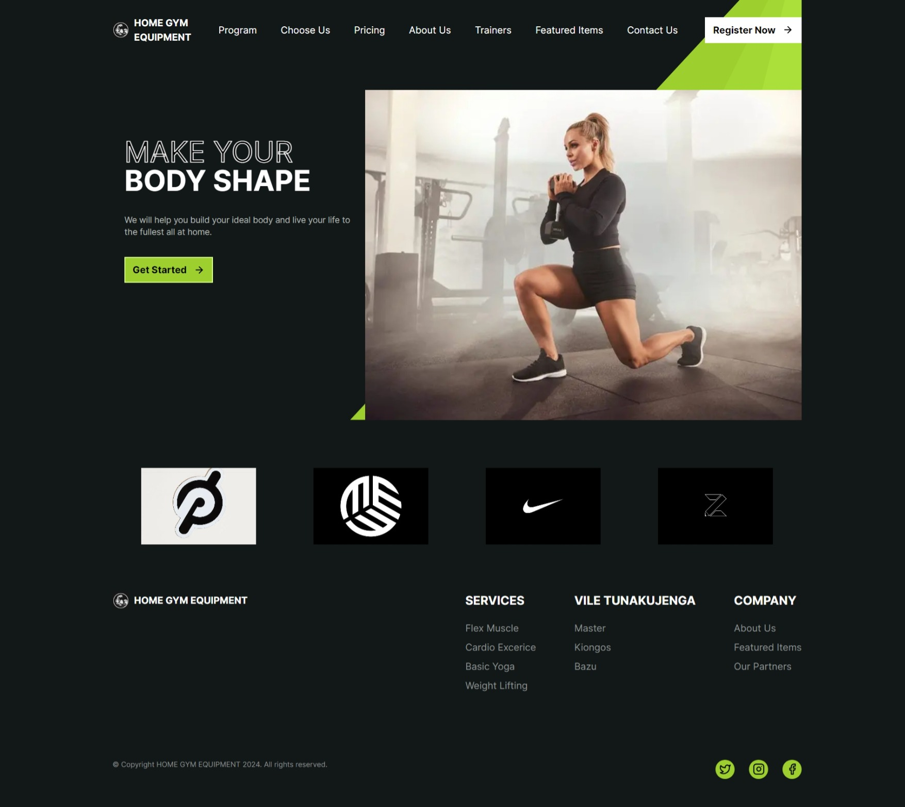
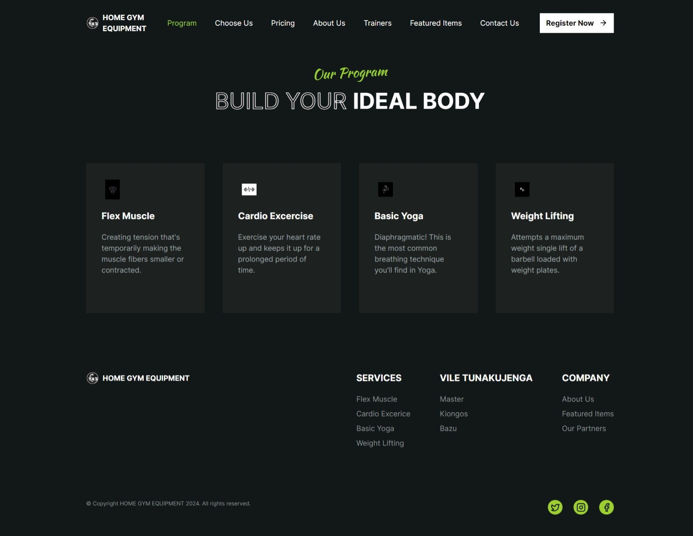
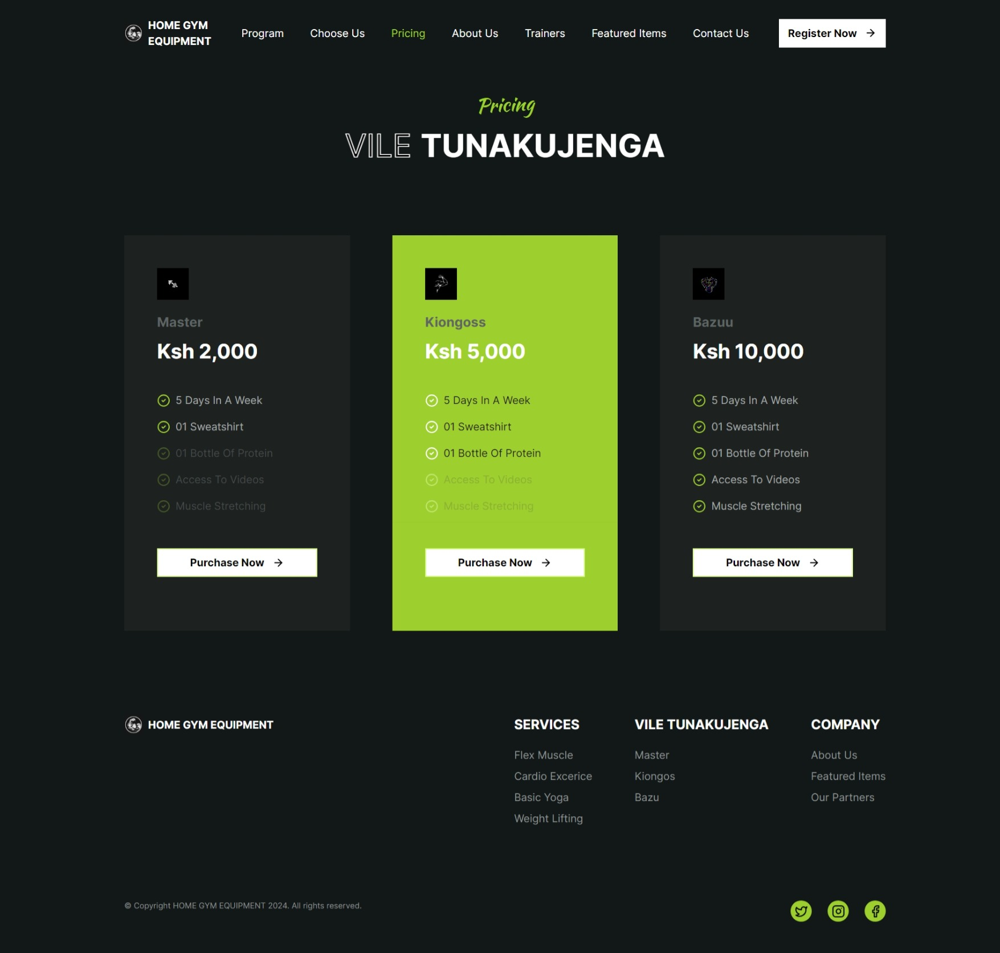
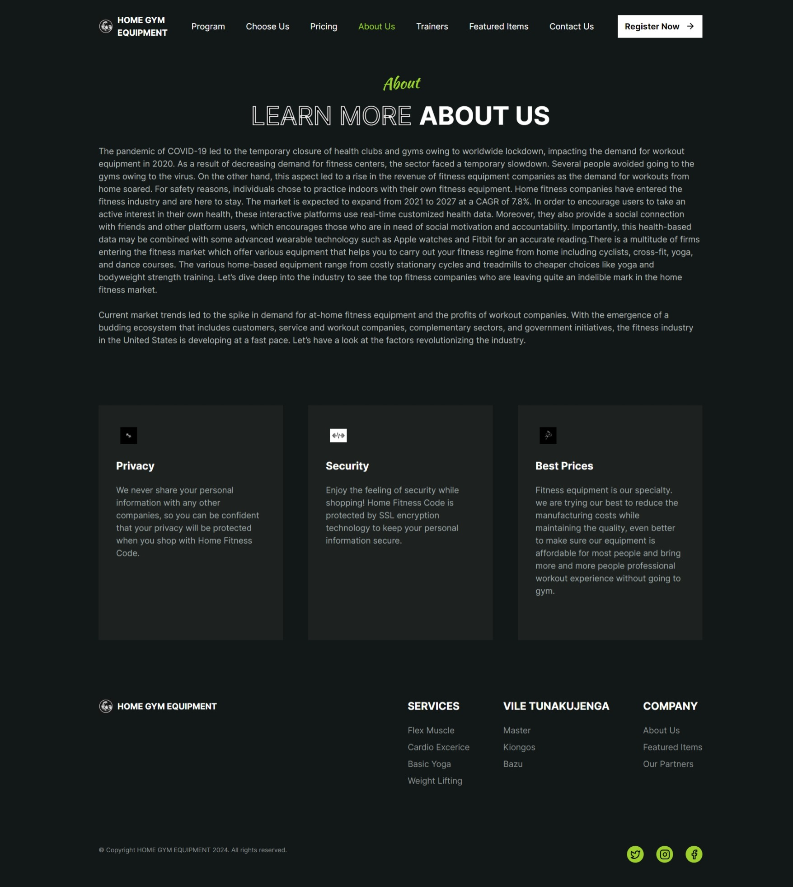
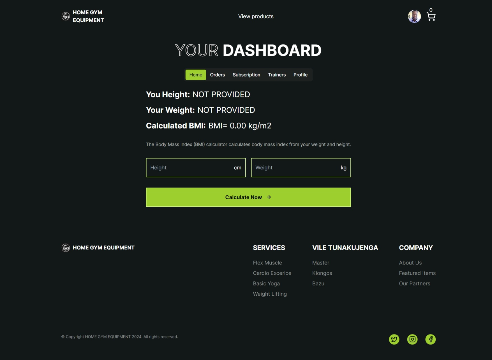
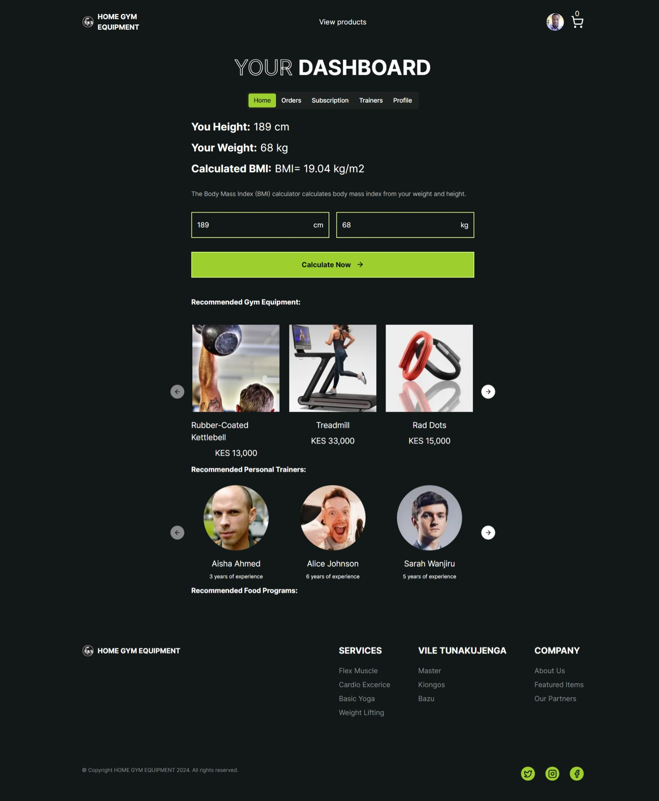

# Home Gym Demo

<video src='./video/home_gym_demo.mp4' width=100%></>

### NOTE:

- The frontend directory contains the prisma database schema and the frontend code
- The postgres database can be seeded with the data in the [seed.ts](./database_migrator/seed/seed.ts) file. This can be done by first creating the database with the provided shema, ie by running the command `npx prisma generate` in the frontend directory, then `npx prisma migrate deploy`, and then finally `npx prisma db seed`. The database migrator container was created to help in running these migrations. You can have the container running then exec into it to run the same commands as above.
- Modify the environment variables in the docker-compose file to match your environment

### Covered in this projet

- [x] Next.js 14
- [x] Prisma
- [x] postgres
- [x] Mpesa payment integration
- [x] Google authentication
- [x] Socket.io integration to handle immediate payment notifications to the paying user
- [x] Docker
- [x] Github Container Registry
- [x] Github Actions
- [x] Github Packages
- [x] Shadcn components
- [x] Tailwind CSS
- [x] Docker compose
- [x] Nest.js (backend)
- [x] Git

Building the images from source - This docker compose file contains postgres database as well as pgadmin to inspect the data stored in your database

```yaml
version: "3"
services:
  frontend:
    container_name: gym-frontend
    depends_on:
      - postgres
      - backend
    build:
      context: ./frontend
      dockerfile: Dockerfile
    networks:
      - gym_network
    ports:
      - "3000:3000"
    environment:
      - DATABASE_URL=postgresql://root:root@pg:5432/home_gym?schema=public
      - NEXTAUTH_URL=http://localhost:3000
      - NEXTAUTH_SECRET=secret
      - GOOGLE_CLIENT_ID=
      - GOOGLE_CLIENT_SECRET=
      # - MPESA
      - MPESA_BUSINESS_SHORT_CODE=
      - MPESA_TRANSACTION_TYPE=CustomerPayBillOnline
      - MPESA_CALLBACK_BASE_URL=http://localhost:3000/api/payments
      - MPESA_PASSKEY=
      - MPESA_STK_PUSH_URL=https://sandbox.safaricom.co.ke/mpesa/stkpush/v1/processrequest
      - MPESA_CONSUMER_KEY=
      - MPESA_CONSUMER_SECRET=
      - MPESA_AUTH_URL=https://sandbox.safaricom.co.ke/oauth/v1/generate?grant_type=client_credentials
      # - callback socket gateway
      - SOCKET_GATEWAY_WEBHOOk_URL=http://gym-backend:3001/webhook/payments
  backend:
    container_name: gym-backend
    build:
      context: ./backend
      dockerfile: Dockerfile
    networks:
      - gym_network
    ports:
      - "3001:3001"

  postgres:
    container_name: pg
    image: postgres:latest
    restart: always
    networks:
      - gym_network
    environment:
      POSTGRES_USER: root
      POSTGRES_PASSWORD: root
      POSTGRES_DB: test_db
    volumes:
      - /data/postgres:/data/postgres
    ports:
      - "5432:5432"

  pgadmin:
    container_name: pgadmin
    image: dpage/pgadmin4
    restart: always
    networks:
      - gym_network
    environment:
      PGADMIN_DEFAULT_EMAIL: root@root.com
      PGADMIN_DEFAULT_PASSWORD: root
    volumes:
      - /data/pgadmin:/root/.pgadmin
    ports:
      - "5050:80"

networks:
  gym_network:
    external: true
```

Pulling the images from Github Container registry

```yaml
version: "3"
services:
  frontend:
    container_name: gym-frontend
    depends_on:
      - postgres
      - backend
    container: ghcr.io/lewynation/gym_frontend:sha-5909b96
    networks:
      - gym_network
    ports:
      - "3000:3000"
    environment:
      - DATABASE_URL=postgresql://root:root@pg:5432/home_gym?schema=public
      - NEXTAUTH_URL=http://localhost:3000
      - NEXTAUTH_SECRET=secret
      - GOOGLE_CLIENT_ID=
      - GOOGLE_CLIENT_SECRET=
      # - MPESA
      - MPESA_BUSINESS_SHORT_CODE=
      - MPESA_TRANSACTION_TYPE=CustomerPayBillOnline
      - MPESA_CALLBACK_BASE_URL=http://localhost:3000/api/payments
      - MPESA_PASSKEY=
      - MPESA_STK_PUSH_URL=https://sandbox.safaricom.co.ke/mpesa/stkpush/v1/processrequest
      - MPESA_CONSUMER_KEY=
      - MPESA_CONSUMER_SECRET=
      - MPESA_AUTH_URL=https://sandbox.safaricom.co.ke/oauth/v1/generate?grant_type=client_credentials
      # - callback socket gateway
      - SOCKET_GATEWAY_WEBHOOk_URL=http://gym-backend:3001/webhook/payments
  backend:
    container_name: gym-backend
    container: ghcr.io/lewynation/gym_socket_backend:sha-5909b96
    networks:
      - gym_network
    ports:
      - "3001:3001"

  postgres:
    container_name: pg
    image: postgres:latest
    restart: always
    networks:
      - gym_network
    environment:
      POSTGRES_USER: root
      POSTGRES_PASSWORD: root
      POSTGRES_DB: test_db
    volumes:
      - /data/postgres:/data/postgres
    ports:
      - "5432:5432"

  pgadmin:
    container_name: pgadmin
    image: dpage/pgadmin4
    restart: always
    networks:
      - gym_network
    environment:
      PGADMIN_DEFAULT_EMAIL: root@root.com
      PGADMIN_DEFAULT_PASSWORD: root
    volumes:
      - /data/pgadmin:/root/.pgadmin
    ports:
      - "5050:80"

networks:
  gym_network:
    external: true
```

## ScreenShots










